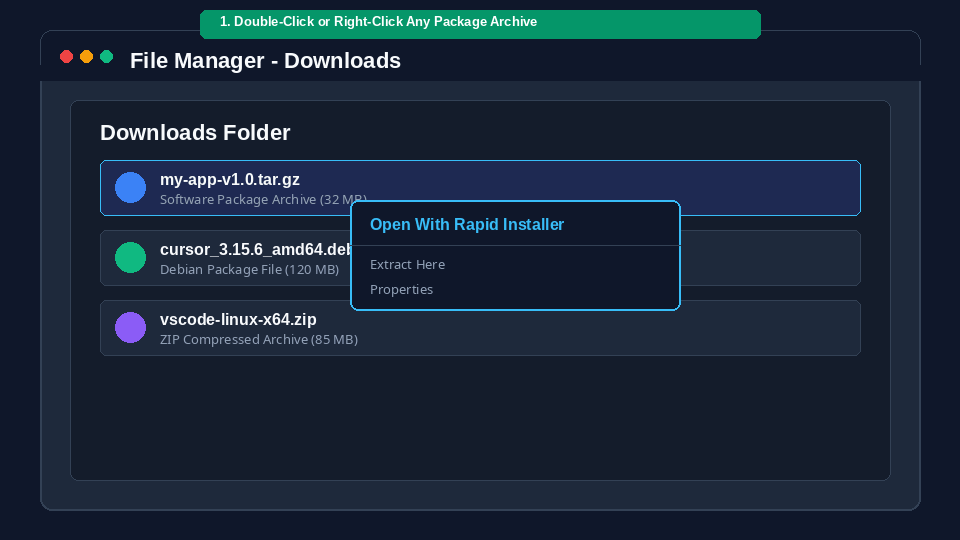

# Rapid Installer ⚡
> **The Ultimate Graphical Application Manager & Package Installer for Linux**

[](LICENSE)
[]()
[]()

<br>

<div align="center">
  
  <br><br>

### 📥 Direct Download & Installation Options

[](https://github.com/anilgudihindala/RapidInstaller/archive/refs/heads/main.zip)
[](https://raw.githubusercontent.com/anilgudihindala/RapidInstaller/main/install.sh)
[](https://github.com/anilgudihindala/RapidInstaller/releases)

</div>

<br>

**Rapid Installer** brings a macOS-style graphical desktop application manager and seamless package deployment experience to Ubuntu, Debian, and Linux platforms. 

No more manual terminal extraction, `sudo` permissions, missing binary hunting, or broken desktop shortcuts! Rapid Installer handles software packages (`.deb`, `.tar.gz`, `.zip`, `.AppImage`, `.rpm`, `.7z`, `.tar.xz`) automatically with **1-click installation**, **GUI App Dashboard**, and **Default System Handler** integration.

---

## 🚀 3 Ways to Get Rapid Installer

### 📥 Option 1: Direct File Download (No Terminal Required!)
1. Click **[Download RapidInstaller.zip](https://github.com/anilgudihindala/RapidInstaller/archive/refs/heads/main.zip)** or **[install.sh](https://raw.githubusercontent.com/anilgudihindala/RapidInstaller/main/install.sh)**.
2. Extract the downloaded ZIP and double-click `install.sh` (or right-click → **Run as a Program**).
3. Done! Rapid Installer is installed on your Desktop and system Applications Menu.

### ⚡ Option 2: 1-Line Instant Terminal Command (Recommended)
Paste this single command into your terminal:

```bash
curl -fsSL https://raw.githubusercontent.com/anilgudihindala/RapidInstaller/main/install.sh | bash
```

*(Rapid Installer installs in 3 seconds, sets up desktop shortcuts, and registers as your default package handler.)*

### 📦 Option 3: GitHub Releases
Download official release packages directly from the **[GitHub Releases Page](https://github.com/anilgudihindala/RapidInstaller/releases)**.

---

## ✨ Features & Graphical Capabilities

### 🖥️ 1. GTK Desktop App Manager Dashboard
Launch **Rapid Installer** from your system application menu or run `rapid-installer` in terminal. It opens a sleek dark-mode GTK3 dashboard showing:
- All installed applications & disk space analytics.
- Live search filtering.
- One-click app launch with real-time **"Launching..."** progress spinner.
- Deep AppCleaner-style 1-click uninstallation.
- Developer runtime toolchain manager (`nvm`, `bun`, `rustup`, `pyenv`, `go`).

### 🖱️ 2. Default System Package Handler (Double-Click Install)
Once installed, Rapid Installer registers as your system default handler for Linux software archives (`.deb`, `.tar.gz`, `.zip`, `.AppImage`):
1. Double-click any package archive in Nautilus / Dolphin / Thunar file manager (or right-click → **Open With Rapid Installer**).
2. Rapid Installer opens a graphical installer dialog.
3. Click **Install**, and your app is deployed into `~/.local/opt/` with launcher icons automatically generated on your Desktop and Applications menu!

### 📦 3. Zero-Sudo Universal User-Space Extraction
Deploy software archives into user-space (`~/.local/opt/`) safely without requiring `sudo` or root privileges.

### 🔍 4. Smart Heuristic Binary Scanner
Automatically scans extracted directory trees and ranks true application binary entry points while filtering out background helper binaries (e.g. `chrome-sandbox`).

### ⚠️ 5. Already-Installed Detection & Upgrades
Opening a package for an already-installed app automatically prompts to **Launch Existing App**, **Reinstall / Upgrade**, or **Cancel**.

---

## ⚡ How to Use

### Method A: Double-Clicking Packages in File Manager (Default)
1. Open your File Manager (Nautilus, Dolphin, etc.).
2. Double-click any software package (`.deb`, `.tar.gz`, `.zip`, `.AppImage`).
3. Click **Install** in the graphical window.

### Method B: Graphical App Manager Dashboard
Launch **Rapid Installer** from your desktop launcher or run in terminal:
```bash
rapid-installer
```

### Method C: Drag & Drop Installation
Drag any package archive file from your file manager directly into the Rapid Installer GTK window.

### Method D: Command Line Interface (CLI / Headless Mode)
```bash
# Install a package archive
rapid-installer /path/to/package.tar.gz

# Headless automated install (non-interactive)
rapid-installer /path/to/package.deb --no-gui --yes

# List installed applications
rapid-installer --list

# Uninstall an application
rapid-installer --uninstall <app-id>
```

---

## 🛠️ Setting as Default System Installer

If you ever need to re-register Rapid Installer as your default system handler for all software packages:
1. Open **Rapid Installer** GTK App Manager.
2. Click **⚙️ Settings** in the top headerbar.
3. Click **★ Set as Default System Package Installer**.

---

## 📄 License
Licensed under the [MIT License](LICENSE).
